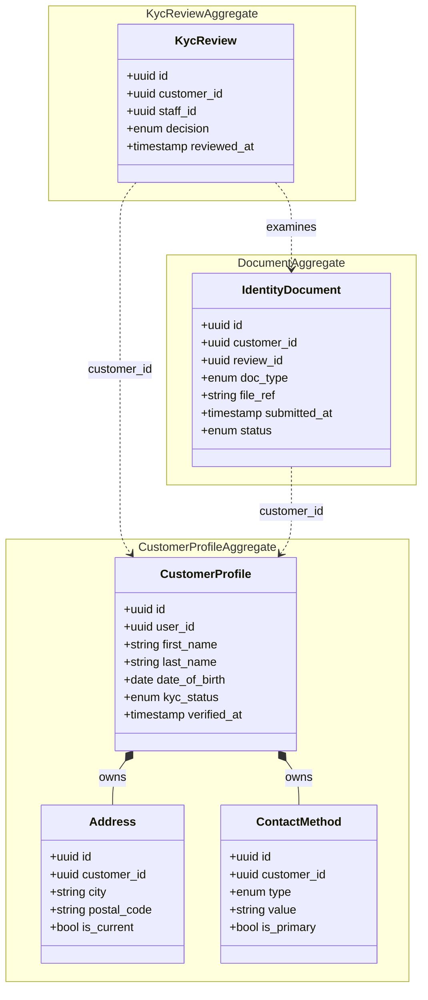

# Database diagram : Onboarding

```mermaid
classDiagram
  namespace CustomerProfileAggregate {
    class CustomerProfile {
      +uuid id
      +uuid user_id
      +string first_name
      +string last_name
      +date date_of_birth
      +enum kyc_status
      +timestamp verified_at
    }
    class Address {
      +uuid id
      +uuid customer_id
      +string city
      +string postal_code
      +bool is_current
    }
    class ContactMethod {
      +uuid id
      +uuid customer_id
      +enum type
      +string value
      +bool is_primary
    }
  }

  namespace KycReviewAggregate {
    class KycReview {
      +uuid id
      +uuid customer_id
      +uuid staff_id
      +enum decision
      +timestamp reviewed_at
    }
  }

  namespace DocumentAggregate {
    class IdentityDocument {
      +uuid id
      +uuid customer_id
      +uuid review_id
      +enum doc_type
      +string file_ref
      +timestamp submitted_at
      +enum status
    }
  }

  CustomerProfile *-- Address : owns
  CustomerProfile *-- ContactMethod : owns
  KycReview ..> CustomerProfile : customer_id
  KycReview ..> IdentityDocument : examines
  IdentityDocument ..> CustomerProfile : customer_id
```

