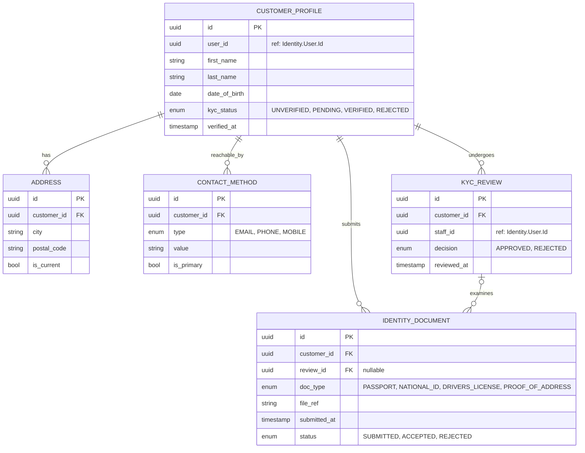

# Database diagram : Onboarding

---

```mermaid
erDiagram
  CUSTOMER_PROFILE ||--o{ ADDRESS : has
  CUSTOMER_PROFILE ||--o{ CONTACT_METHOD : reachable_by
  CUSTOMER_PROFILE ||--o{ IDENTITY_DOCUMENT : submits
  CUSTOMER_PROFILE ||--o{ KYC_REVIEW : undergoes
  KYC_REVIEW |o--o{ IDENTITY_DOCUMENT : examines
  CUSTOMER_PROFILE {
    uuid id PK
    uuid user_id "ref: Identity.User.Id"
    string first_name
    string last_name
    date date_of_birth
    enum kyc_status "UNVERIFIED, PENDING, VERIFIED, REJECTED"
    timestamp verified_at
  }
  ADDRESS {
    uuid id PK
    uuid customer_id FK
    string city
    string postal_code
    bool is_current
  }
  CONTACT_METHOD {
    uuid id PK
    uuid customer_id FK
    enum type "EMAIL, PHONE, MOBILE"
    string value
    bool is_primary
  }
  IDENTITY_DOCUMENT {
    uuid id PK
    uuid customer_id FK
    uuid review_id FK "nullable"
    enum doc_type "PASSPORT, NATIONAL_ID, DRIVERS_LICENSE, PROOF_OF_ADDRESS"
    string file_ref
    timestamp submitted_at
    enum status "SUBMITTED, ACCEPTED, REJECTED"
  }
  KYC_REVIEW {
    uuid id PK
    uuid customer_id FK
    uuid staff_id "ref: Identity.User.Id"
    enum decision "APPROVED, REJECTED"
    timestamp reviewed_at
  }

```

---
